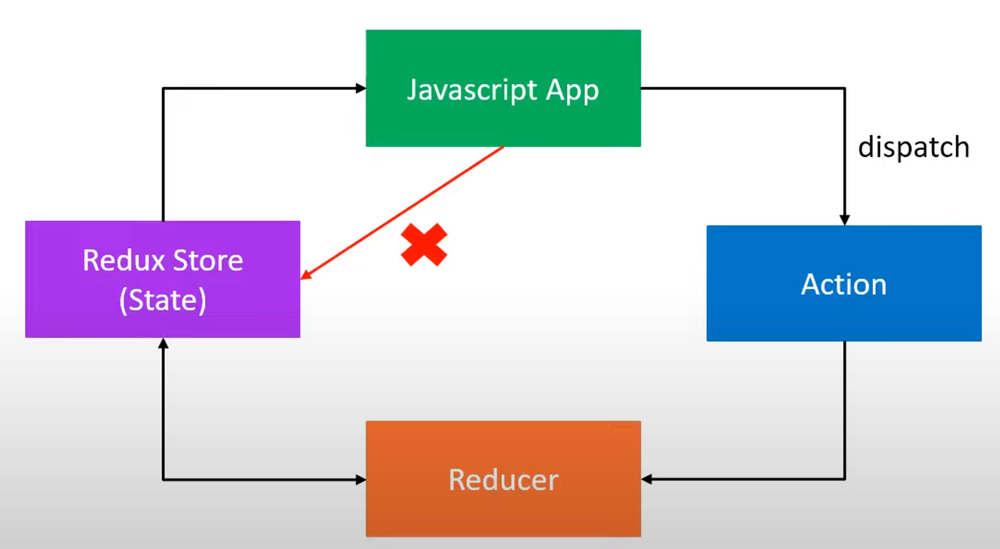

# Redux Practice

## Why Do we need `Redux`?

> Redux is a predictable container for Javascript application

1. Centralized application state: Redux provides a single source of truth for your entire app's state in a single store. This makes it easier to track changes and debug issues.
   
2. Predictable state management: Redux enforces strict rules for how state can be updated via pure reducer functions. This makes the state changes more predictable and easier to test.
   
3. Simplified communication between components: Components can subscribe to specific state slices they need instead of passing props down manually through every level.

### Pathway to learn Redux

> Redux -> Redux toolkit -> React Redux

## How to apply state in `Redux`?



### Store：儲存資料狀態（state）的地方

```jsx
const initialState = {
  name: "Sam",
  address: {
    street: "123 Main St",
    city: "New York",
    state: "MA",
  },
};

const store = redux.createStore(reducer);
```

 `createStore` ：建立store
`getState`：取得當前的狀態
`dispatch`：改變狀態

### Action：描述該如何操作狀態（state）

```jsx
const STREET_UPDATED = "STREET_UPDATED";

const updateStreet = (street) => {
  return {
    type: STREET_UPDATED,
    payload: street,
  };
};
```

`bindActionCreators`：bundle with multiple `action`

### Reducer：Store與Action的中介者

```jsx
const reducer = (state = initialState, action) => {
  switch (action.type) {
    case STREET_UPDATED:
      return produce(state, (draft) => {
        draft.address.street = action.payload;
      });
    default:
      return state;
  }
};
```

`applyMiddleware`：處理非同步

## Related Dependencies

- `immer` :Useful tool to edit Object in Javascript.
- `redux-thunk` : Deal with `async` state (etc: fetch data from backend) 
- `redux-toolkit` : Make `Redux` more efficient and aviod redundent code.
- `redux-devtools` :Debugging application's state changes.
- `redux-react` : Communicate from 'Redux' to React UI Library.

## Source

1. [Redux Toolkit Tutorial](https://www.youtube.com/watch?v=0awA5Uw6SJE&list=PLC3y8-rFHvwiaOAuTtVXittwybYIorRB3&index=1)
2. [Next.js上使用 Redux四兄弟](https://medium.com/@upstairs0102/next-js上使用-redux四兄弟-cc44582891de)